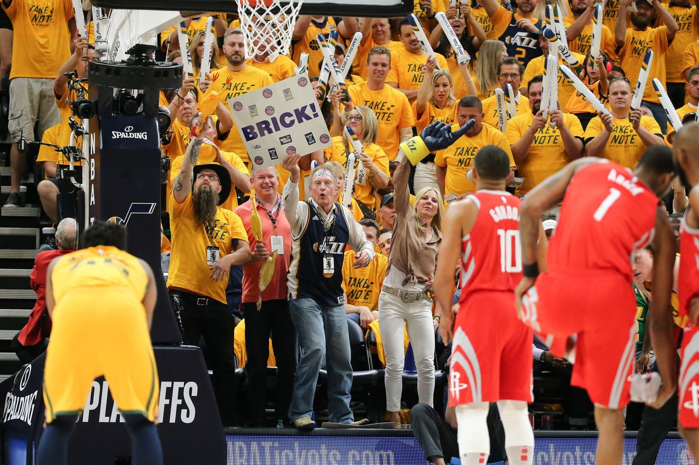

<style type="text/css">
@font-face {
    font-family: 'chick';
    font-style: normal;
    font-weight: normal;
    src: local('font-fil-a'), 
    url('font-fil-a-webfont.woff2') format('woff2'),
    url('font-fil-a-webfont.woff') format('woff'),url('font-fil-a.ttf') format('truetype');
}
@font-face {
    font-family: 'nba';
    font-style: normal;
    font-weight: normal;
    src: local('OLD SPORT 01 COLLEGE NCV'), 
    url('old_sport_01_college_ncv-webfont.woff2') format('woff2'),
         url('old_sport_01_college_ncv-webfont.woff') format('woff'),
         url('OLD SPORT 01 COLLEGE NCV.ttf') format('truetype'),
        url('old_sport_01_college_ncv-webfont.svg#old_sport_01_college_ncvRg') format('svg');
}

body{ /* Normal  */
      font-size: 16px;
  }
td {  /* Table  */
  font-size: 16px;
  class: tbltxt;
  text-align: center;
}
th{
text-align: left;
}

h1.title {
  font-family: 'chick';
  font-size: 72px;
  color: Red;
  font-weight: bold;
}
h1 { /* Header 1 */
  font-size: 28px;
  color: DarkBlue;
}
h2 { /* Header 2 */
    font-size: 22px;
  color: DarkRed;
}
h3 { /* Header 3 */
  font-size: 32px;
  font-family: 'nba';
  color: #2498FE;
}
code.r{ /* Code block */
    font-size: 12px;
}
pre { /* Code block - determines code spacing between lines */
    font-size: 14px;
}
caption {
      color: red;
      font-weight: bold;
      font-size: 1.0em;
    } 
    .tbltxt {
  text-align: center;
  font-style: normal;
  font-size: 18px;
}
</style>


```{r setup, include=FALSE}
knitr::opts_chunk$set(echo = FALSE)
library(here)
library(scales)
library(plotly)
```

</br>
<thead>
<tr class="header">
<center>

</center>
</tr>
</thead>

</table></br>
</br>

# The Promo


"Fowl Play" is the name of the popular promotion that Chick-Fil-A currently has with several NBA teams. The idea is simple, every fourth quarter at a home game of a team participating there is an opportunity for everyone in the audience (or the entire state in the case of the Utah Jazz) to earn a free chicken sandwich if the visiting team misses two consecutive free throws. 

Questions then arise such as does this promotion even work in favor of Chick-Fil-A? How much does Chick-Fil-A gain or lose if free sandwiches are awarded? And most importantly how likely are you and I to get free chicken? To answer these questions we first have to turn to how this came to be. 

# Inception

The brainstorming started in 2010 when John Natolly, a franchise owner, was having trouble getting people in the door of his Chick-Fil-A location. While brainstorming ideas with Lew Strudler, a marketing executive from Monumental Sports the idea came up to do something similar to the Houston Astros that had a "Fowl Pole" promo that would give free chicken sandwiches to the audience if players hit certain foul poles in the stadium. 

The original idea was to give away free chicken if a Wizards player missed a free throw in the fourth quarter but was shot down. Not only is this extremely likely but this would result in fans booing the home team if they miss a free throw. The next idea was to have free chicken if the home team won, another idea that was shot down almost immediately because of how often it would occur. 

The third idea stuck. If an opposing player on the same trip to the foul line misses two consecutive free throws then everyone in attendance gets free chicken. This resulted in an extremely successful game promotion that has almost ten times the redemption rate of normal game or ticket promotions. But why has it stuck around for so long? Why do the odds favor this promotion for Chick-Fil-A compared to the other two that didn't work?


# Free Throw Frequency

An easy first step is to check if there is a difference between the number of free throws taken in each quarter. It would make sense to have more free throws in the fourth quarter because of the more prevalent strategy to foul more to prevent the opposing team from scoring more points. 
</br>
<center>

```{r}

p <- plot_ly(
  x = c("1", "2", "3", "4"),
  y = c(116962, 154218, 154108,186280),
  name = "Free Throws by Quarter",
  type = "bar",  width = 400, height = 400
) %>% layout(autosize=F)

p

```

</center>
</br>

This chart shows that indeed free throws in the fourth quarter are much more common than the other quarters. This could help our chances of free chicken but but in order to get the correct probability we have to look at sets of two or more free throws and see if there is a difference when certain teams are playing. The tables below show the counts of these sets for the NBA Jazz, Wizards, and Bulls home games. These teams are chosen because they were running the promo during the time period contained in the data set, 2006-2016. 


## Entire NBA

<table>
<thead>
<tr class="header">
<th>Quarter</th>
<th>Sets of Free Throws</th>
<th>Sets of two cons. made</th>
<th>Sets of two cons. missed</th>
</tr>
</thead>
<tbody>
<tr class="odd">
<td>1</td>
<td>63,268</td>
<td>29,275 (`r round(29275/63268,2)` \%)</td>
<td>6,988 (`r round(6988/63268,2)` \%)</td>
</tr>
<tr class="odd">
<td>2</td>
<td>82,404</td>
<td>38,636 (`r round(38363/82404,2)` \%)</td>
<td>9,104 (`r round(9104/82404,2)` \%)</td>
</tr>
<tr class="odd">
<td>3</td>
<td>81,415</td>
<td>39,578 (`r round(39578/81415,2)` \%)</td>
<td>8,367 (`r round(8367/81415,2)` \%)</td>
</tr>
<tr class="odd">
<td>4</td>
<td>95,947</td>
<td>43,985 (`r round(43985/95947,2)` \%)</td>
<td>9,647 (`r round(9647/95947,2)` \%)</td>
</tr>
</tbody>
</table>

## Utah Jazz Home Games

<table style="width:100%">
<thead>
<tr class="header">
<th>Quarter</th>
<th>Sets of Free Throws</th>
<th>Sets two made</th>
<th>Sets two missed</th>
</tr>
</thead>
<tbody>
<tr class="odd">
<td>1</td>
<td>2,322</td>
<td>1,020 (`r round(1020/2322,2)` \%)</td>
<td>257 (`r round(257/2322,2)` \%)</td>
</tr>
<tr class="odd">
<td>2</td>
<td>3,055</td>
<td>1,376 (`r round(1376/3055,2)` \%)</td>
<td>331 (`r round(331/3055,2)` \%)</td>
</tr>
<tr class="odd">
<td>3</td>
<td>3,297</td>
<td>1,328 (`r round(1328/3297,2)` \%)</td>
<td>387 (`r round(387/3297,2)` \%)</td>
</tr>
<tr class="odd">
<td>4</td>
<td>3,536</td>
<td>1,657 (`r round(1657/3536,2)` \%)</td>
<td>356 (`r round(356/3536,2)` \%)</td>
</tr>
</tbody>
</table>


## Washington Wizards Home Games

<table style="width:100%">
<thead>
<tr class="header">
<th>Quarter</th>
<th>Sets of Free Throws</th>
<th>Sets two made</th>
<th>Sets two missed</th>
</tr>
</thead>
<tbody>
<tr class="odd">
<td>1</td>
<td>1,990</td>
<td>884 (`r round(884/1990,2)`\%)</td>
<td>233 (`r round(233/1990,2)`\%)</td>
</tr>
<tr class="odd">
<td>2</td>
<td>2,720</td>
<td>1,217 (`r round(1217/2720,2)`\%)</td>
<td>297 (`r round(297/2720,2)`\%)</td>
</tr>
<tr class="odd">
<td>3</td>
<td>2,706</td>
<td>1,261 (`r round(1261/2706,2)`\%)</td>
<td>270 (`r round(270/2706,2)`\%)</td>
</tr>
<tr class="odd">
<td>4</td>
<td>3,220</td>
<td>1,486 (`r round(1486/3220,2)`\%)</td>
<td>330 (`r round(330/3220,2)`\%)</td>
</tr>
</tbody>
</table>


## Chicago Bulls Home Games

<table style="width:100%">
<thead>
<tr class="header">
<th>Quarter</th>
<th>Sets of Free Throws</th>
<th>Sets two made</th>
<th>Sets two missed</th>
</tr>
</tbody>
<tr class="odd">
<td>1</td>
<td>2,115</td>
<td>926 (`r round(926/2115,2)`\%)</td>
<td>245 (`r round(245/2115,2)`\%)</td>
</tr>
<tr class="odd">
<td>2</td>
<td>2,799</td>  
<td>1,253 (`r round(1253/2799,2)`\%)</td>
<td>290 (`r round(290/2799,2)`\%)</td>
</tr>
<tr class="odd">
<td>3</td>
<td>2,784</td>
<td>1,255(`r round(1255/2784,2)`\%)</td>
<td>296(`r round(296/2784,2)`\%)</td>
</tr>
<tr class="odd">
<td>4</td>
<td>3,303</td>
<td>1,614(`r round(1614/3303,2)`\%)</td>
<td>319(`r round(356/3303,2)`\%)</td>
</tr>
</table>

These tables show that the proportion of sets of free throws that result in two consecutive missed is consistently about 10\% across all quarters. Even though there are more free throws in the fourth quarter the odds that two consecutive are missed don't really change. But there is a problem with just saying that the probability of getting free chicken is 10\% because in order for the promotion to be valid we only need this to happen once during the fourth quarter. The probability of it occurring just once should be more likely than it occurring in general during the fourth quarter. Not only do we have to incorporate other factors such as it needing to be a home game or by an opponent but it should be much more unlikely for it not to occur at all during an entire game.  

# Probability of Free Chicken Sandwich

Obviously calculating the precise probability for free chicken for a given game can be a tedious exercise. The fact is every player has a different free throw shooting percentage that may vary according by home game or away game and the roster is ever changing season to season. We can however look at historical data to see how often free throws had two consecutive misses to approximate this probability. The law of large numbers works in our favor here because over time the differences in free throw percentages start to equal out to the expected behavior. Outliers in free throw percentage will come along but we can be confident in an estimate based on the past.

The data set I use contains all free throws between 2006 and 2016 which has 618,000 free throw instances. This is assumed to be a sufficient sample size to estimate the probability and the free throws are also assumed to be independent. The probability of free chicken is denoted by $P(C)$ where $C$ is the event that a game results in free chicken. More formally 

$$
C = \{\text{opponent misses two consecutive free throws in fourth quarter} \}.
$$
Let $X$ be a Bernoulli random variable that takes value 0 if $C$ does not occur in a game and 1 if $C$ does occur. $X$ can be thought of as a coin flip, but the probability of success (1) is something different than 0.5. 

In order to find $P(C) = P(X=1)$ the compliment must be examined. For $C$ to occur there only needs to be one instance of an opponent missing two consecutive free throws. If the number of times this occurred in general was counted then we would be including games where it occurred more than once. A reformulation is necessary to arrive at a more precise probability. To reformulate the compliment rule in probability theory is used.

$$
P(C) = P(\text{at least one instance of two missed free throws}) = 1-P(\text{no instances of two missed free throws})
$$
The latter probability is much easier to calculate with the available data. It simplified to only need a count of the games in which no instances of two consecutive missed free throws occurs. The proportion of home games with no consecutive missed free throws in the fourth quarter is just around 75\% for the Utah Jazz, Washington Wizards, Chicago Bulls, and the entire NBA. Thus the compliment of this $(1-0.75=0.25)$ is 25%. For comparison if they had decided to stick with the home team player missing a free throw this occurs every game with just above a 99\% probability. 

# Binomial random variable

Now that we have a sufficient estimate for the probability of success we can then look at the probability of free chicken occurring a given number of times throughout the entire season. $X$ was defined as a Bernoulli random variable with probability of success $p=0.25$. Let $N$ be the random number of times that free chicken occurs during the regular season. Because each game is an independent Bernoulli random variable we know that $N$ is just the number of successes in a set of $n=41$ trials. Thus $N$ is a binomial random variable with parameters $p=0.25, n=41$. Using the properties of the binomial distribution we can reach further conclusions. 

First the mean or expected value of a binomial random variable is 

$$
E[N] = np. 
$$
Thus the expected number of games during regular season that result in free chicken is $np=41*0.25=$ `r 0.25*41` games. The standard deviation of a binomial random variable is 

$$
\sqrt{np(1-p)}.
$$
So the number of games that vary around the mean of `r 0.25*41` is $\sqrt{(41)(0.25)(1-0.25)}=$ `r sqrt(0.25*41*(1-0.25))`. This says that the number of games that result in free chicken is expected to be with high probability between about 7 and 13 games.

</br>
<center>
```{r}

game_vec <- c(0:41)

probabilities <- dbinom(game_vec,41,0.25)

data <- data.frame(cbind(game_vec, probabilities))

p <- plot_ly(data, x = ~game_vec, y = ~probabilities, type = 'scatter', mode = 'lines', line = list(color = 'rgb(205, 12, 24)', width = 4)) %>% 
  layout(title = "Probability of free chicken",
         xaxis = list(title = "# Times During Season"),
         yaxis = list (title = "Probability"))

p

```
</center>
</br>

This graph shows what the probability for a given number of games to result in free chicken. The probability that no games have it is almost zero which says that the probability that at least one game has it is almost one. The most likely number of games to have this is 10.


# Excpected chicken sandwiches

The binomial model gives a really easy way to compute the expected number of games that result in free chicken. This makes quantities like expected number of free sandwiches possible. This will be broken down into the Jazz audience and the state of Utah because of the recent change in promotional strategy. 

## Jazz audience

Currently the Vivint Smart Home Arena can hold 18,300 people. Prior to the 2019 season Chick-Fil-A required a ticket stub to redeem the free chicken. Assuming a [25\%](https://ftw.usatoday.com/2017/10/how-free-chick-fil-a-made-fans-stop-caring-if-their-team-was-winning-or-losing-for-nearly-a-decade) worst case promotion redemption rate this means that Chick-Fil-A can expect to give 4,575 chicken sandwiches away. At a price of \$3.05 this would cost Chick-Fil-A `r dollar(4575*3.05)` per occurrence. 

We can then take the number of expected games that will result in this loss for Chick-Fil-A, 10, and come up with how much they will expect to spend during a regular season. Multiplying these two results we get `r dollar(round(10*4575*3.05),2)`.

## State of Utah

The current population of Utah is 3.161 million. With the promotion now valid for anyone in the state with a smartphone (assume [80\%](https://www.pewinternet.org/fact-sheet/mobile/)) with the app (assume 50\%) this estimated cost with 25\% redemption jumps to `r dollar(round(0.25*0.8*0.5*3161000*3.05))`. So during a regular season they can likely anticipate spending `r dollar(round(0.25*0.8*0.5*3161000*3.05*10,2))` just on free chicken. This of course doesn't include the cost to hold the promotion in 41 home games which I would guess to be between 1-4 million per year. This may seem like a big jump but keep in mind that in Utah alone the Chick-Fil-A franchise has 31 locations that do anywhere from 1-3 million a year putting gross revenue for the state at upwards of 90 million a year. 


# Marketing Value

The value of a marketing strategy, product investment, or really any business decision is getting harder to evaluate just based on dollar spend for dollar revenue amounts on a short term basis. Companies are realizing that owning in-house customer data or having an app can be far more valuable than traditional sponsorships or promotions. Chick-Fil-A is no stranger to this idea because they are clearly valuing the push for customers to use their app rather than just to get people through the door which was the original goal. Getting people through the door with a free chicken sandwich usually isn't a total loss either because its easy to justify paying for fries and a drink when you aren't paying for a sandwich. 

Incentivizing people to download the app has much more value than foot traffic though. It almost a proven fact that if you have a loyalty program through a smartphone app users will spend more money with your company more frequently. A [recent study](https://appinstitute.com/why-restaurants-need-mobile-apps/) that evaluated the impact an app can have on a restaurant put out that the average amount spent per order increased by 51\% over the course of a year with the app. The average number of orders per month increased by 105\% and the average annual spend per customer increased by 112\%. Essentially this study showed that you can double your sales per customer by having an effective app that links users to the business. If this is true, Chick-Fil-A is now spending about 11 million in hopes of increasing sales to upwards of 180 million.

So remember next time you attend, nay, next time there IS a Jazz home game there is a 1 in 4 chance of being able to open your app to a free chicken sandwich the next day. Not bad for a lottery. 

# Sources

Code used for analysis available on [GitHub](https://github.com/GuitarPro6/nba-chicken).

[1] “The Cost to Reach 1,000 People: Nuanced Thoughts.” Nuanced Media, 24 May 2019, https://nuancedmedia.com/cost-reach-1000-people/.

[2] “Demographics of Mobile Device Ownership and Adoption in the United States.” Pew Research Center: Internet, Science & Tech, 12 June 2019, https://www.pewinternet.org/fact-sheet/mobile/.

[3] Mandell, Nina. “How Free Chick-Fil-A Made Fans Stop Caring If Their Team Was Winning or Losing for Nearly a Decade.” USA Today, Gannett Satellite Information Network, 5 Oct. 2017, https://ftw.usatoday.com/2017/10/how-free-chick-fil-a-made-fans-stop-caring-if-their-team-was-winning-or-losing-for-nearly-a-decade.

[4] Mantey, Sebastian. “NBA Free Throws.” Kaggle, ESPN, https://www.kaggle.com/sebastianmantey/nba-free-throws/download.

[5] Meier, Chris. “Mobile Apps for Restaurants - Why You Need One 12 Huge Benefits.” AppInstitute, 17 Oct. 2019, https://appinstitute.com/why-restaurants-need-mobile-apps/.

